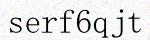
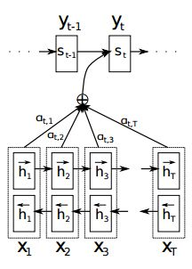
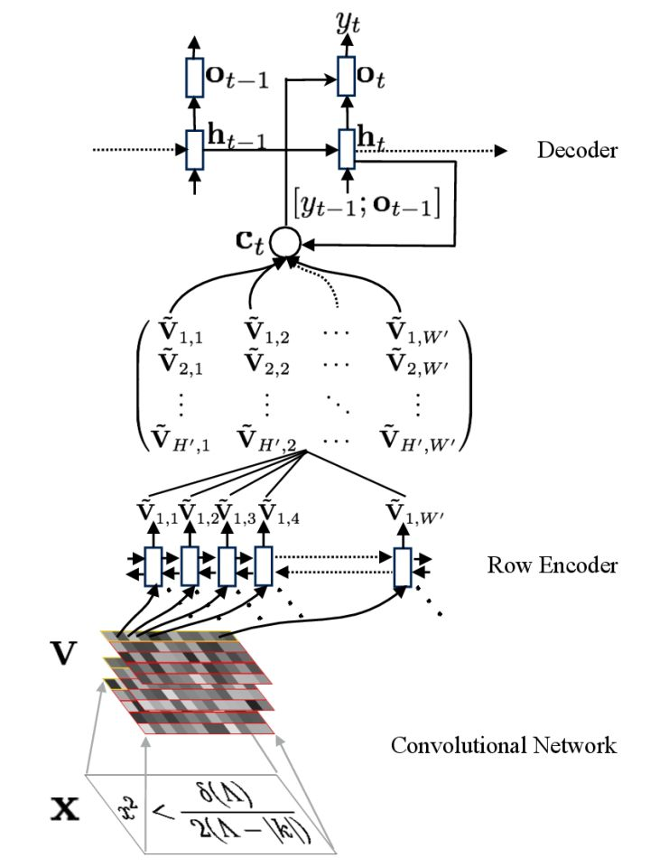

# **seq2seq+attention**解决**ocr**端对端识别任务


## env
python3,tensorflow1.4


## usage
* 生成数据
```bash
python gen_data.py#生成图片,默认生成只含数字和字母的图片，可以根据需要生成中文图片
python gen_txt.py#生成train.txt,val.txt
```
* 训练
```bash
python im2str.py#默认使用的原始论文中的attention模型，如下图１,decoder2.py中实现；也可以调用decoder.py中attention模型,如下图２

```
$ f(x)=w^Tx+b $
* 测试  

```bash
python test.py#test 415_2.jpg
Result: serf6qjt
```
* attention 原理



图１

<br>
　
图２
